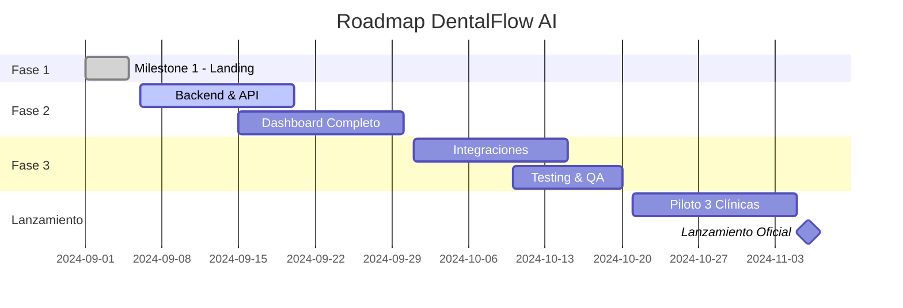

# 🏆 MILESTONES - DentalFlow AI

## 📅 Timeline General del Proyecto

---

## ✅ MILESTONE 1: Landing Page & Demo Dashboard
**Estado:** COMPLETADO ✅
**Fecha:** 1-5 Septiembre 2024
**Duración:** 5 días

### Objetivos Logrados:
- [x] Landing page profesional y atractiva
- [x] 100% responsive (mobile-first)
- [x] Chat simulador idéntico a WhatsApp
- [x] Dashboard demo con login funcional
- [x] Deploy automático en EasyPanel
- [x] Documentación completa

### Entregables:
1. **Landing Page**
   - Hero con simulador WhatsApp animado
   - 6 features principales
   - 3 planes de precios (Gratis, Básico, Completo)
   - Tabla comparativa "Con vs Sin DentalFlow"
   - Testimonios realistas
   - CTA efectivos

2. **Dashboard Demo**
   - Login: demo@dentalflow.ai / demo123
   - Vista principal con estadísticas
   - Sidebar navegable
   - Diseño responsive

3. **Infraestructura**
   - GitHub repository configurado
   - CI/CD con EasyPanel
   - Dominio: dentalflow-frontend.easypanel.host

### Métricas:
- Componentes creados: 15
- Líneas de código: ~3,500
- Commits: 53
- Build time: <30s
- Lighthouse Score: 95+

### Lecciones Aprendidas:
- Evitar promesas exageradas en copy
- WhatsApp UI requiere colores específicos
- Build local antes de push
- Imágenes locales > CDNs externas

---

## 🔄 MILESTONE 2: Backend & API Core
**Estado:** PENDIENTE 
**Fecha estimada:** 6-20 Septiembre 2024
**Duración:** 15 días

### Objetivos:
- [ ] API REST con Node.js/Express
- [ ] Base de datos PostgreSQL
- [ ] Autenticación JWT
- [ ] CRUD de clínicas
- [ ] CRUD de pacientes
- [ ] CRUD de citas
- [ ] Sistema de mensajería

### Entregables Planeados:
1. **API Endpoints**
   - `/auth/*` - Login, registro, refresh token
   - `/clinics/*` - Gestión de clínicas
   - `/patients/*` - Gestión de pacientes  
   - `/appointments/*` - Gestión de citas
   - `/messages/*` - Historial de mensajes

2. **Base de Datos**
   - Schema optimizado
   - Migrations configuradas
   - Seeders de prueba

3. **Documentación**
   - Swagger/OpenAPI spec
   - Postman collection
   - README técnico

### Stack Propuesto:
- Node.js + Express/Fastify
- PostgreSQL + Prisma ORM
- JWT + bcrypt
- Joi/Zod validations
- Jest para testing

---

## 📊 MILESTONE 3: Dashboard Completo
**Estado:** PENDIENTE
**Fecha estimada:** 15-30 Septiembre 2024
**Duración:** 15 días

### Objetivos:
- [ ] Dashboard real con datos dinámicos
- [ ] Gestión completa de citas
- [ ] Vista de calendario
- [ ] Chat/mensajería integrada
- [ ] Reportes y analytics
- [ ] Configuración de clínica

### Features Planeadas:
1. **Gestión de Citas**
   - Calendario interactivo
   - Drag & drop para reagendar
   - Estados: confirmada, pendiente, cancelada
   - Recordatorios automatizados

2. **Gestión de Pacientes**
   - Ficha completa del paciente
   - Historial de citas
   - Notas y observaciones
   - Tags y segmentación

3. **Analytics**
   - Tasa de asistencia
   - Ingresos proyectados
   - Pacientes frecuentes
   - Horas pico

---

## 🔌 MILESTONE 4: Integraciones Externas
**Estado:** PENDIENTE
**Fecha estimada:** 1-15 Octubre 2024
**Duración:** 15 días

### Objetivos:
- [ ] WhatsApp Business API
- [ ] Pasarela de pagos (Azul/Cardnet)
- [ ] Email transaccional (SendGrid)
- [ ] SMS gateway (Twilio)
- [ ] Google Calendar sync

### Integraciones Críticas:
1. **WhatsApp Business**
   - Envío automatizado
   - Plantillas aprobadas
   - Webhooks para respuestas
   - Estado de mensajes

2. **Pagos**
   - Suscripciones recurrentes
   - Facturación automática
   - Gestión de planes
   - Historial de pagos

---

## 🧪 MILESTONE 5: Testing & Optimización
**Estado:** PENDIENTE
**Fecha estimada:** 10-20 Octubre 2024
**Duración:** 10 días

### Objetivos:
- [ ] Testing exhaustivo
- [ ] Optimización de performance
- [ ] Seguridad audit
- [ ] UX improvements
- [ ] Bug fixes

### Tipos de Testing:
1. **Funcional**
   - Unit tests (80%+ coverage)
   - Integration tests
   - E2E tests críticos

2. **No Funcional**
   - Performance testing
   - Security testing
   - Usability testing
   - Compatibility testing

---

## 🚀 MILESTONE 6: Piloto con 3 Clínicas
**Estado:** PENDIENTE
**Fecha estimada:** 21 Oct - 5 Nov 2024
**Duración:** 15 días

### Objetivos:
- [ ] Onboarding de 3 clínicas piloto
- [ ] Monitoreo en tiempo real
- [ ] Recolección de feedback
- [ ] Ajustes basados en uso real
- [ ] Preparación para lanzamiento

### Métricas de Éxito:
- Reducción de ausencias: >20%
- Satisfacción usuarios: >4.5/5
- Bugs críticos: 0
- Uptime: 99.9%
- Adopción features: >80%

### Clínicas Piloto (Tentativo):
1. Clínica pequeña (1-2 dentistas)
2. Clínica mediana (3-5 dentistas)  
3. Clínica grande (6+ dentistas)

---

## 🎯 LANZAMIENTO OFICIAL
**Fecha objetivo:** 6 Noviembre 2024

### Criterios de Lanzamiento:
- ✓ Todos los milestones completados
- ✓ Feedback piloto implementado
- ✓ 0 bugs críticos
- ✓ Documentación completa
- ✓ Equipo de soporte listo
- ✓ Plan de marketing activo

### Plan Post-Lanzamiento:
1. **Semana 1-2:** Soporte intensivo
2. **Semana 3-4:** Primera iteración
3. **Mes 2:** Nuevas features basadas en feedback
4. **Mes 3:** Expansión y escalamiento

---

## 📈 Métricas de Éxito del Proyecto

### KPIs Técnicos:
- Uptime: >99.9%
- Response time: <200ms
- Error rate: <0.1%
- Test coverage: >80%

### KPIs de Negocio:
- Clínicas activas: 50+ en 3 meses
- Reducción ausencias: >25% promedio
- NPS: >8.5
- Churn: <5% mensual
- ROI para clínicas: >300% año 1

### KPIs de Producto:
- Adopción features: >80%
- Daily active users: >70%
- Mensajes enviados: >10k/mes
- Citas confirmadas: >85%

---

**Documento actualizado:** 5 Septiembre 2024
**Próxima revisión:** Inicio Milestone 2
**Responsable:** Equipo DentalFlow